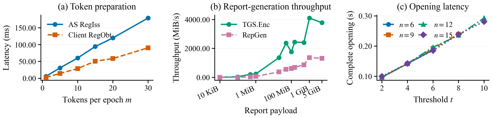
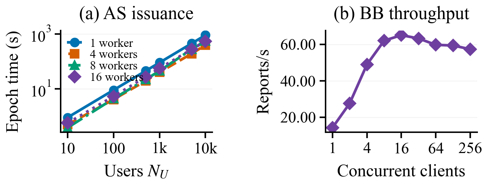

<div align="center">

# 🛡️ AWARE: Accountable Anonymous Reporting with Threshold Opening

[TL;DR](#tldr) • [Overview](#overview) • [Code Map](#code-map) • [Setup](#setup) • [Run Experiments](#run-experiments) • [Citation](#citation)

[[Repository](https://github.com/Zora-G/AWARE)]


</div>

<p align="center">
  
</p>

<p align="center"><em>AWARE provides anonymous report submission with holder binding, one-shot acceptance, and accountable threshold opening.</em></p>

<a id="tldr"></a>
## ✨ TL;DR

**AWARE** is a cryptographic reporting artifact for anonymous submissions that remain accountable under a threshold opening process. This repository contains the minimal Rust implementation and benchmark harness used for the BN462 manuscript measurements.

| What to know | AWARE in one line |
| --- | --- |
| 🎯 Protocol | Complete Rust implementation of `Setup`, `RegU`, `RegIss`, `RegObt`, `RepGen`, `PostAccept`, `RepDec`, and `RepCom`. |
| 🔐 Instantiation | MIRACL Core BN462, SHA-256 transcripts, AES-256-GCM payload encryption, and canonical AWCE/AWCL framing. |
| ⚙️ Defaults | `m=15`, `n=5`, `t=3`, `lambda=128`, 1 MiB payloads, 30 measured trials, and 10 warmups. |
| 📊 Evaluation | Benchmark entry points reproduce Table II, Fig. 2, Fig. 3, Table III, and the AWARE-side columns of Table IV. |
| 📦 Scope | Rust protocol, experiment scripts, pinned Cargo dependencies, and Table IV GlobaLeaks provenance are included; old Java and paper-build artifacts are excluded. |

The package is intentionally small: source code, tests, benchmark drivers, configuration, and the comparison data needed to render the reported tables.

<a id="overview"></a>
## 🔍 Overview

AWARE separates anonymous report generation from accountable threshold opening. A user obtains one of `m` epoch-scoped tokens, generates a report bound to the token holder, and posts it to a bulletin board that accepts the first valid serial. Committee members later contribute verifiable decryption shares, and the combiner either recovers the report or identifies invalid opening contributions.

The Rust implementation follows the latest BN462 migration contract in [`rust_protocol/MIGRATION.md`](./rust_protocol/MIGRATION.md). It keeps the measured operation boundaries used by the paper: setup, registration, issuer token generation, user token obtainment, report generation, bulletin-board acceptance, committee decryption, and opening combination.

<p align="center">
  
</p>

<p align="center"><em>System-level sweeps measure issuer token generation and bulletin-board acceptance throughput under the same benchmark harness.</em></p>

<a id="code-map"></a>
## 🗺️ Code Map

| Path | Purpose |
| --- | --- |
| [`rust_protocol/`](./rust_protocol/) | Complete AWARE BN462 Rust implementation, Cargo manifest, lockfile, tests, and vendored MIRACL Core BN462 code. |
| [`rust_protocol/src/tnibs.rs`](./rust_protocol/src/tnibs.rs) | Registration and token issuance/obtainment: `RegU`, `RegIss`, and `RegObt`. |
| [`rust_protocol/src/tgs.rs`](./rust_protocol/src/tgs.rs) | Threshold encryption, share decryption, and share combination. |
| [`rust_protocol/src/protocol.rs`](./rust_protocol/src/protocol.rs) | Report generation and bulletin-board acceptance: `RepGen` and `PostAccept`. |
| [`rust_protocol/src/opening.rs`](./rust_protocol/src/opening.rs) | Accountable threshold opening: `RepDec` and `RepCom`. |
| [`rust_protocol/src/bin/aware-bench.rs`](./rust_protocol/src/bin/aware-bench.rs) | Benchmark binary for every paper operation and ablation. |
| [`experiments/config/defaults.json`](./experiments/config/defaults.json) | Default parameters and sweeps: `m=15`, `n=5`, `t=3`, `lambda=128`, payload sizes, worker counts, and trial schedules. |
| [`experiments/scripts/`](./experiments/scripts/) | Pipeline, rendering, Table IV AWARE-side benchmark, and comparison-data seeding scripts. |
| [`experiments/data/globaleaks_official_comparison/`](./experiments/data/globaleaks_official_comparison/) | Bundled official GlobaLeaks 5.0.99 comparison data and provenance for Table IV rendering. |
| [`materials/`](./materials/) | README figures generated by the benchmark renderer. |

### Result-to-code map

| Paper result | Execution / preprocessing | Analysis |
| --- | --- | --- |
| Table II | `experiments/scripts/run_pipeline.py --target TableII` | `experiments/scripts/render_results.py` |
| Fig. 2 | `experiments/scripts/run_pipeline.py --target Fig2` | `experiments/scripts/render_results.py`, emits `fig2_aware_bn462.{pdf,png,svg}` |
| Fig. 3 | `experiments/scripts/run_pipeline.py --target Fig3` | `experiments/scripts/render_results.py`, emits `fig3_aware_bn462.{pdf,png,svg}` |
| Table III | `experiments/scripts/run_pipeline.py --target TableIII` | `experiments/scripts/render_results.py` |
| Table IV, AWARE side | `experiments/scripts/run_table_iv_aware.sh` | `experiments/scripts/render_results.py` |
| Table IV, GlobaLeaks side | `experiments/scripts/reuse_comparison.py` | Validates and copies bundled official comparison summaries |

<a id="setup"></a>
## ⚙️ Setup

The recorded artifact environment used Ubuntu 24.04, Python 3.12, OpenSSL, and a Xeon Gold 6133 server for server-side timings. The checked-in `Cargo.lock` was generated with Rust 1.89.0 and is intended for Rust 1.89 or newer.

```bash
git clone https://github.com/Zora-G/AWARE.git
cd AWARE

python3 -m venv .venv
source .venv/bin/activate
python -m pip install --upgrade pip
python -m pip install -r requirements.txt

cargo build --release --locked --features benchmarks --manifest-path rust_protocol/Cargo.toml
```

On macOS with Homebrew OpenSSL, expose the library path when building or testing:

```bash
export LIBRARY_PATH="$(brew --prefix openssl@3)/lib"
```

Focused implementation checks:

```bash
cargo fmt --check --manifest-path rust_protocol/Cargo.toml
cargo test --locked --manifest-path rust_protocol/Cargo.toml
```

<a id="run-experiments"></a>
## 🚀 Run Experiments

Build the benchmark binary:

```bash
experiments/scripts/build_release.sh
```

Inspect the benchmark interface:

```bash
rust_protocol/target/release/aware-bench \
  <operation> <runs> <warmups> <n> <t> <m> <payload_bytes> <users> <workers> <clients> [stream]
```

Supported operations are `Setup`, `RegU`, `RegIss`, `RegObt`, `TGSEnc`, `RepGen`, `PostAccept`, `RepDec`, `RepCom`, `CompleteOpen`, `HolderAblation`, `OpeningAblation`, `EpochIssuance`, `BB`, and `ReplayRace`.

Example with the default paper parameters:

```bash
rust_protocol/target/release/aware-bench RepGen 30 10 5 3 15 1048576 1 8 1
```

Run the manuscript artifact sweep for Table II, Fig. 2, Fig. 3, and Table III:

```bash
experiments/scripts/run_fig2_fig3_table2_table3.sh
```

Use CPU pinning on the server host when reproducing the recorded setup:

```bash
AWARE_CPUS=0-39 experiments/scripts/run_fig2_fig3_table2_table3.sh
```

Run only the AWARE-side measurements for Table IV:

```bash
experiments/scripts/run_table_iv_aware.sh
```

Seed the bundled GlobaLeaks comparison files for Table IV rendering:

```bash
experiments/scripts/seed_table_iv_comparison.sh
```

Generated tables are written under `results/paper/summary/`. Generated figures are written under `figures/paper/`.

### Reproducibility notes

- The default configuration is [`experiments/config/defaults.json`](./experiments/config/defaults.json).
- Fig. 2 uses token-preparation, report-throughput, and threshold-opening sweeps.
- Fig. 3 uses issuer-scaling and bulletin-board-throughput sweeps.
- Fig. 2(b) report-generation points use the streaming interface and the recorded per-payload trial schedule.
- Table IV reuses unchanged official GlobaLeaks 5.0.99 comparison data from the same Xeon host and retains its provenance in [`experiments/data/globaleaks_official_comparison/`](./experiments/data/globaleaks_official_comparison/).
- Large generated outputs are excluded from Git history; reruns populate `results/` and `figures/`.
- See [`SECURITY.md`](./SECURITY.md) before adapting the artifact beyond manuscript reproduction.

<a id="citation"></a>
## 📚 Citation

If you use this code, please cite the AWARE manuscript. GitHub can also read the repository metadata from [`CITATION.cff`](./CITATION.cff).

```bibtex
@misc{aware2026bn462,
  title        = {AWARE: Accountable Anonymous Reporting with Threshold Opening},
  author       = {Gao, Ge},
  year         = {2026},
  howpublished = {Research artifact},
  url          = {https://github.com/Zora-G/AWARE}
}
```

<a id="license"></a>
## 📄 License

This repository is a public research snapshot. The source is provided under the proprietary terms recorded in [`CITATION.cff`](./CITATION.cff); no broad open-source license is granted. Third-party dependencies retain their own licenses.

